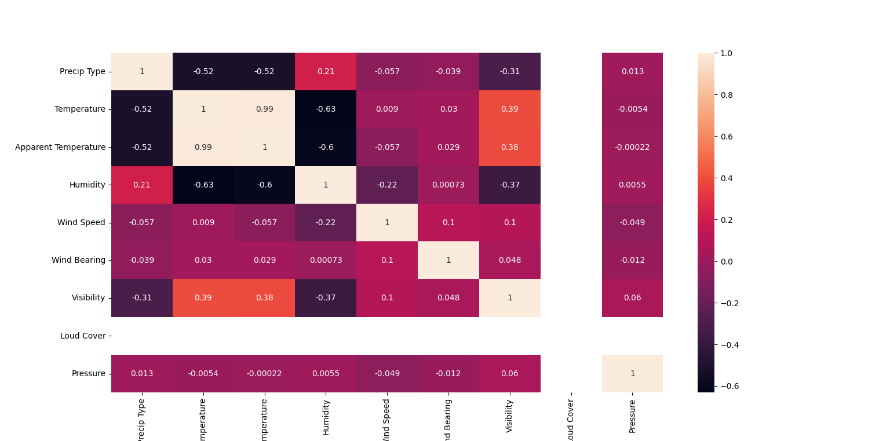

datasets:https://www.kaggle.com/datasets/budincsevity/szeged-weather

Linear Regression Mean Squared Error 37.788614575460336
Linear Regression R2=Score 0.582273525038618
-----------------------------------
Lasso Linear Regression Mean Squared Error 41.36992699510768
Lasso Linear Regression R2=Score 0.5426846427892486
-----------------------------------
Ridge Regression Mean Squared Error 37.7886144173037
Ridge Regression R2=Score 0.5822735267869281
-----------------------------------
RidgeCV Regression Mean Squared Error 37.7886144173037
RidgeCV Regression R2=Score 0.5822735267869281
-----------------------------------
Yeni Linear Regression Mean Squared Error 0.8884235236673785
Yeni Linear Regression R2=Score 0.9901791047122604
-----------------------------------
Yeni Lasso Linear Regression Mean Squared Error 2.2773589588819187
Yeni Lasso Linear Regression R2=Score 0.9748254033442856
-----------------------------------
Yeni Ridge Regression Mean Squared Error 0.8884205664440324
Yeni Ridge Regression R2=Score 0.9901791374022783
-----------------------------------
Yeni RidgeCV Regression Mean Squared Error 0.8884232256417396
Yeni RidgeCV Regression R2=Score 0.9901791080067236